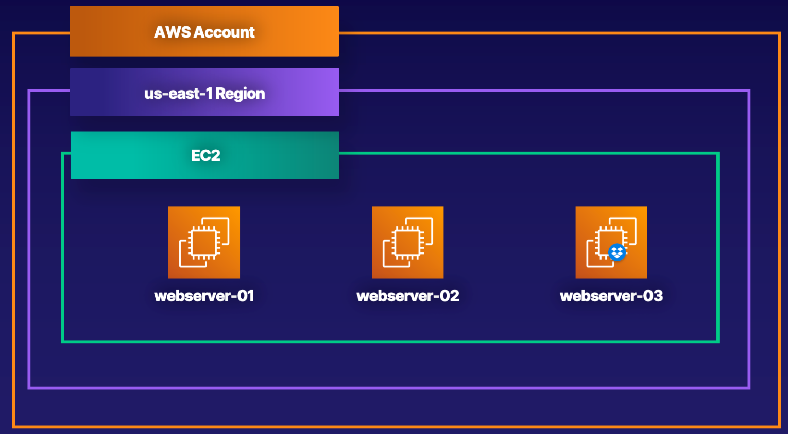

# Lab 01 - [AWS - EC2 Instance Bootstrapping](https://learn.acloud.guru/handson/76d34af6-77cb-42e4-b35f-99f9eca6d219)

1. Launch the A Cloud Guru lab using the link provided above
1. Click "Start Lab" - feel free to listen to the provided introduction if you wish
1. View the Lab Diagram for a visual of what we will be building in this lab

4. Follow along with the step-by-step instructions provided in the "Guide" tab for the lab
