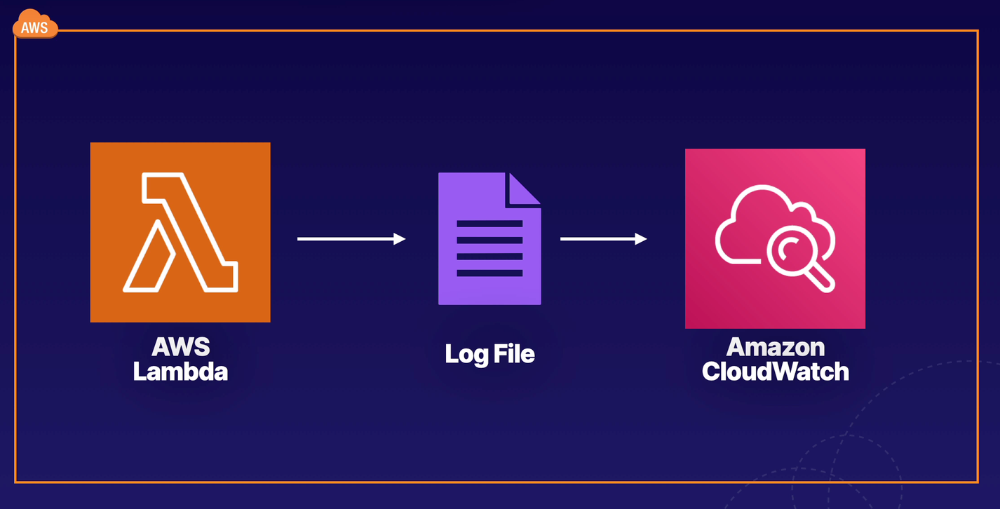

# Lab 02 - [AWS - Lambda Using AWS Console](https://learn.acloud.guru/handson/a0645bc3-152d-44c8-8706-bf309f4c846e)

1. Launch the A Cloud Guru lab using the link provided above
1. Click "Start Lab" - feel free to listen to the provided introduction if you wish
1. View the Lab Diagram for a visual of what we will be building in this lab



4. Follow along with the step-by-step instructions provided in the "Guide" tab for the lab
1. After completing the described steps (and prior to checking logs for the function in CloudWatch), update your index.js code to something like the following:

```
const https = require('https');

exports.handler = async function(event) {
    let statusCode;
    await new Promise(function(resolve, reject) {
        https.get(event["url"], (res) => {
            statusCode = res.statusCode;
            resolve(statusCode);
        }).on("error", (e) => {
            reject(Error(e));
        });
    });
    console.log(statusCode);
    return statusCode;
};
```

6. Click "Deploy" to deploy the changes
6. Configure a new test event, give it the name of "myTestEvent2", and use the following for the "Event JSON" section of the test event:

```
{
    "url": "https://www.google.com"
}
```

8. Click "Save"
8. Click the dropdown arrow next to "Test" and make sure "myTestEvent2" is selected
8. Click "Test" and observe the results
8. Configure a new test event, give it the name of "myTestEvent3", and use the following for the "Event JSON" section of the test event:

```
{
    "url": "https://www.blah.com"
}
```

12. Click "Save"
12. Click the dropdown arrow next to "Test" and make sure "myTestEvent3" is selected
12. Click "Test" and observe the results
12. Click the "Configuration" tab (3 tabs over from the "Code" tab) and click "Permissions"
12. Under "Execution role" click the provided link for "Role name" - this will launch a new tab in IAM (Identity and Access Management) allowing you to view the properties for the role
12. Under "Permissions policies", click the "+" sign next to the listed policy to see the permissions associated to the Lambda by default
12. Continue with the outlined steps to view logs for the function in CloudWatch - notice the multiple successful executions as well as the unsuccessful execution
