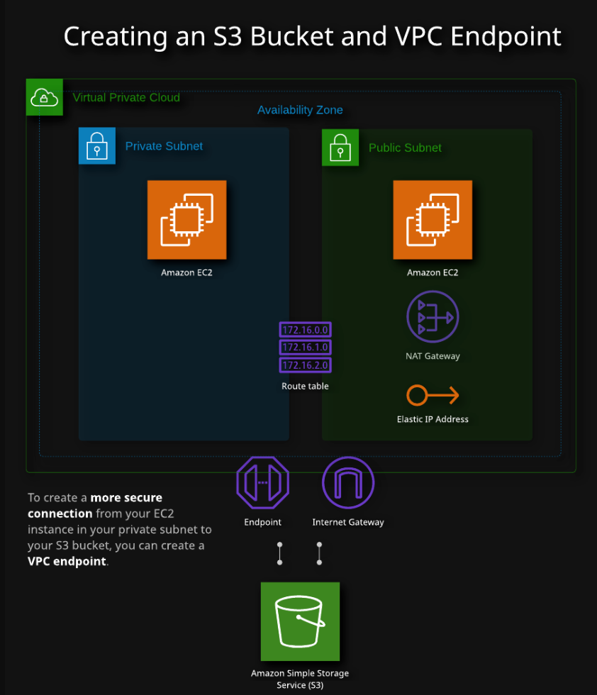

# Lab 04 - [AWS - S3 and VPC](https://learn.acloud.guru/handson/37331c72-e3f1-4ded-9607-61d993fbb5a5)

1. Launch the A Cloud Guru lab using the link provided above
1. Click "Start Lab" - feel free to listen to the provided introduction if you wish
1. View the Lab Diagram for a visual of what we will be building in this lab

4. Follow along with the step-by-step instructions provided in the "Guide" tab for the lab
1. After completing the lab steps, delete the endpoint created in the earlier steps and try accessing the s3 bucket list again (using `aws s3 ls`); the terminal will not return results now because the access route between the private EC2 instance and S3 has been severed
1. Use `Ctrl + C` to cancel the `aws s3 ls` execution
1. In the terminal, use `exit` to logout of the private instance and use `exit` again to logout of the public instance
1. Try running the 'ssh cloud_user@<PRIVATE_IP_ADDRESS>` statement again but directly from your local machine; once again the terminal will hang as direct access to the private instance from outside of the VPC is not allowed
1. Use `Ctrl + C` to cancel the `ssh` execution