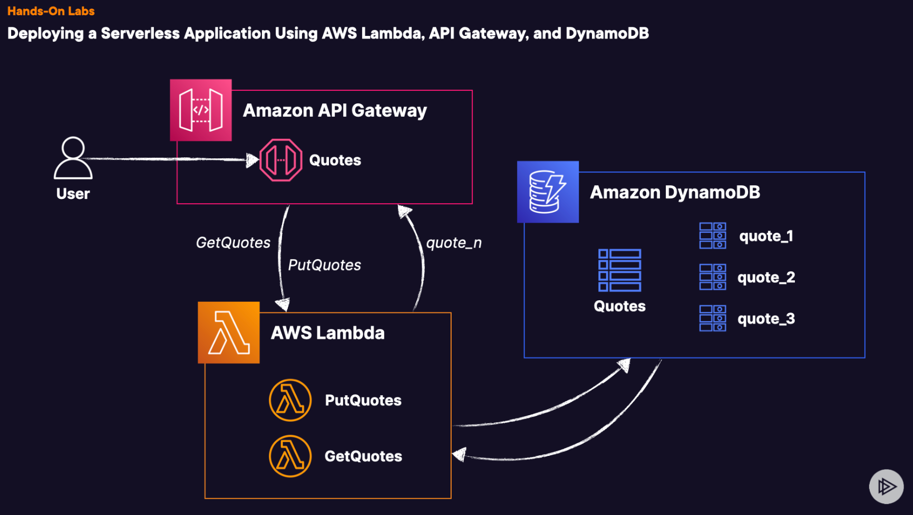

# Lab 07 - [AWS - Serverless with DB](https://learn.acloud.guru/handson/65e07c9d-919f-4256-a94b-379c344b3cd7)

1. Launch the A Cloud Guru lab using the link provided above
1. Click "Start Lab" - feel free to listen to the provided introduction if you wish
1. View the Lab Diagram for a visual of what we will be building in this lab

4. Follow along with the step-by-step instructions provided in the "Guide" tab for the lab
1. Upon completion of the lab steps as defined, navigate to the "GetQuotes" Lambda and replace the code with the contents of the provided "updated-get-quotes.py"; make sure you deploy the updates to the function
1. Attempt to run the "PutQuotes" operation a few more times
1. Run the "GetQuotes" operation a few times - randomly you should see "ERROR: You were unlucky!!!" message
1. Navigate to X-Ray and view the traces; drill down into one of the error traces to see how it differs from the others
