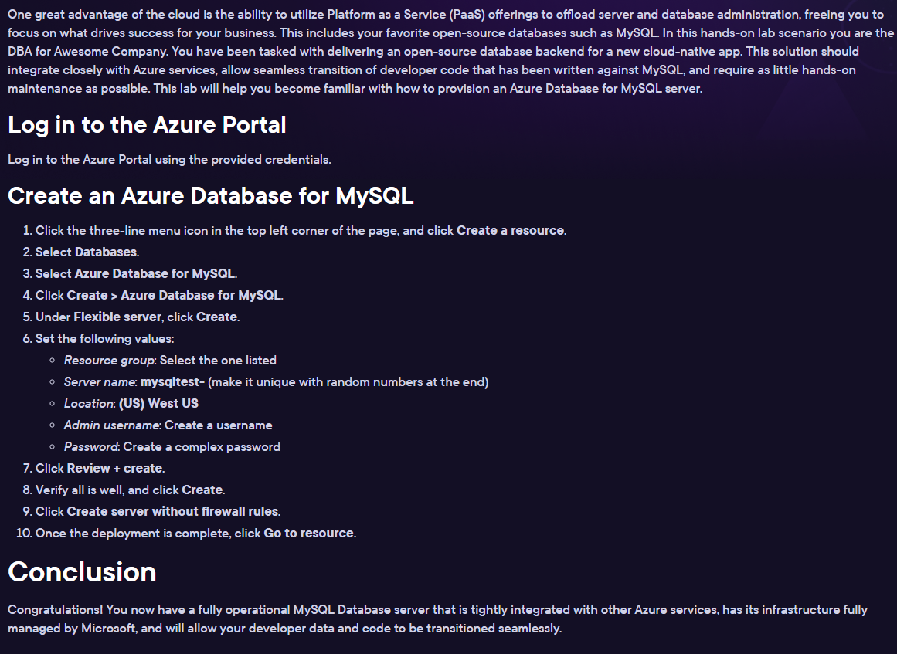

# Lab 08 - [Azure - MySQL Database](https://learn.acloud.guru/handson/7a9044b4-8392-4346-82f6-73b6ec215938)

1. For this lab, instead of using the provided lab environment, we're going to use a Playground (to give us a little more time to complete the work)
1. Login to your A Cloud Guru account
1. Click the "Playground" icon at the top of the page
1. Click the "Start Azure Sandbox" button
1. Login to the Azure Sandbox using the provided instructions and credentials
1. Follow along with the step-by-step instructions provided in the "Guide" tab for the lab - see 
1. Make note of the FQDN assigned to the MySQL instance
1. After completion of regular lab, execute the following steps:
    - Navigate to the Resource Group
    - Click "Create", select "Compute", and click "Create" under "Ubuntu Server 20.04 LTS", and select "Ubuntu Server 20.04 LTS"
    - Make sure the only available Subscription and Resource Group are selected
    - Give your VM a name (e.g., "azure-mysql")
    - Select "West US" for the region
    - Leave all other settings at their defaults and click "Review + create"
    - Click "Create"
    - When prompted, click "Download private key and create resource"
    - Once resource creation has completed, click "Go to resource"
    - Click the "Connect" dropdown and select "Connect"
    - Click "Select" under "Native SSH"
    - Follow the provided instructions to login to the VM; you will likely need to change the permissions on the ".pem" key using `chmod 0400 <key-name>.pem` before connecting
    - Once connected, run `sudo apt-get update && sudo apt-get upgrade`
    - Install the MySQL client tools using `sudo apt-get install mysql-client -y`
    - Navigate to the MySQL instance and click "Networking" under "Settings"
    - Under "Firewall rules", add a new rule for your VM's IP address - give the rule a name and paste in the VM's IP address for "Start" and "End"; click "Save"
    - Connect to MySQL from the terminal session of your VM using `mysql -u mysqladmin -h <FQDN for MySQL instance> -P 3306 -p`; when prompted, enter the password you used when creating the database
    - Once connected, execute `CREATE DATABASE widgets;` and then `USE widgets;`
    - Execute the following:

    ```
    CREATE TABLE Catalog (
    WidgetId int NOT NULL AUTO_INCREMENT,
    Name varchar(50) NOT NULL,
    Description varchar(100),
    PRIMARY KEY (WidgetId)
    );
    ```

    - Execute the following:

    ```
    INSERT INTO Catalog (
    Name, Description) VALUES (
    'Thing-a-Ma-Bob', 'Regular old thing-a-ma-bob'
    );
    ```

    - Execute the following:

    ```
    INSERT INTO Catalog (
    Name, Description) VALUES (
    'What-Cha-Ma-Call-It', 'Handy dandy new widget'
    );
    ```

    - Execute `SELECT * FROM Catalog;` to verify the presence of the new records
