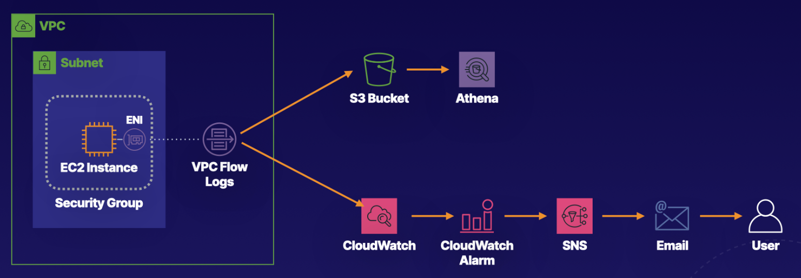

# Lab 03 - [AWS - VPC Flow Logs](https://learn.acloud.guru/handson/41ff95a9-5f14-4c9d-bc2d-ce4e2ca27347)

1. Launch the A Cloud Guru lab using the link provided above
1. Click "Start Lab" - feel free to listen to the provided introduction if you wish
1. View the Lab Diagram for a visual of what we will be building in this lab

4. Follow along with the step-by-step instructions provided in the "Guide" tab for the lab
1. Once the defined lab steps have been completed, explore the "IaC generator" in CloudFormation in AWS - this tool can be used to generate a CloudFormation template (or CDK application) for the resources deployed manually in the lab
